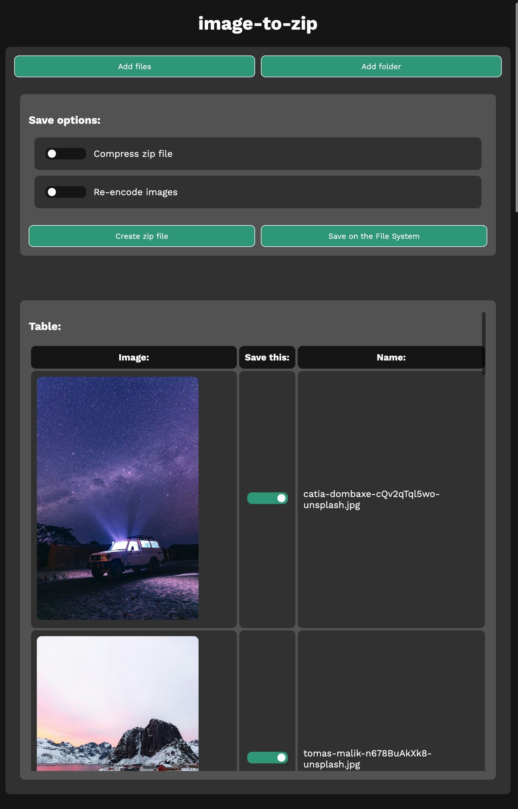
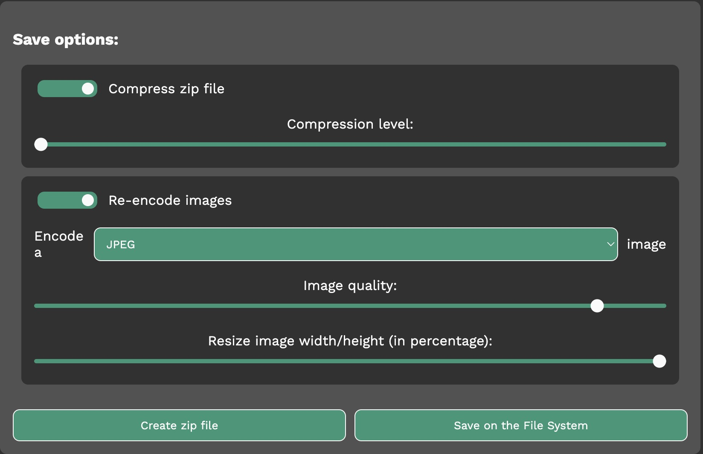

# image-to-zip

Choose images, display them in a table, and save them in a zip file (or natively
using the File System API)

## Usage

Go to https://dinoosauro.github.io/image-to-zip/ and choose the images you want
to save in a Zip file. All of them will be displayed in a table.

Above the table, you can choose to compress the zip file (and its compression
level), or to re-encode the images. In this case, you'll be able to choose the
output format, the output quality, and the output width/height (in percentage):

Finally, you can choose to save the images in a zip file, or to save them
directly on a folder in your device (if your browser supports it).

### Settings

In the Settings, you can choose how many images should be displayed at a time.
Keep this number quite low, otherwise the website might slow down. You can also
choose to uncheck the images by default.

Finally, you can download the webpage in a simple HTML file, so that you can use
it completely offline.

## Privacy

Your data is never sent to an external server: everything is elaborated locally.
